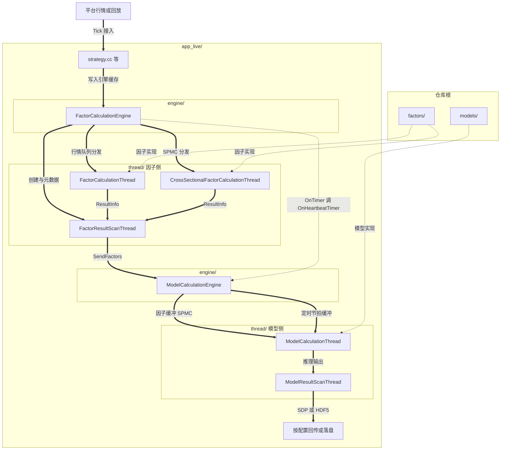
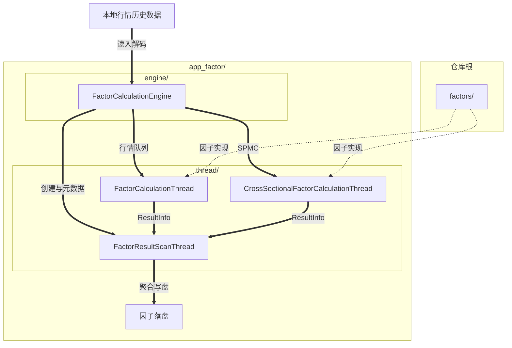
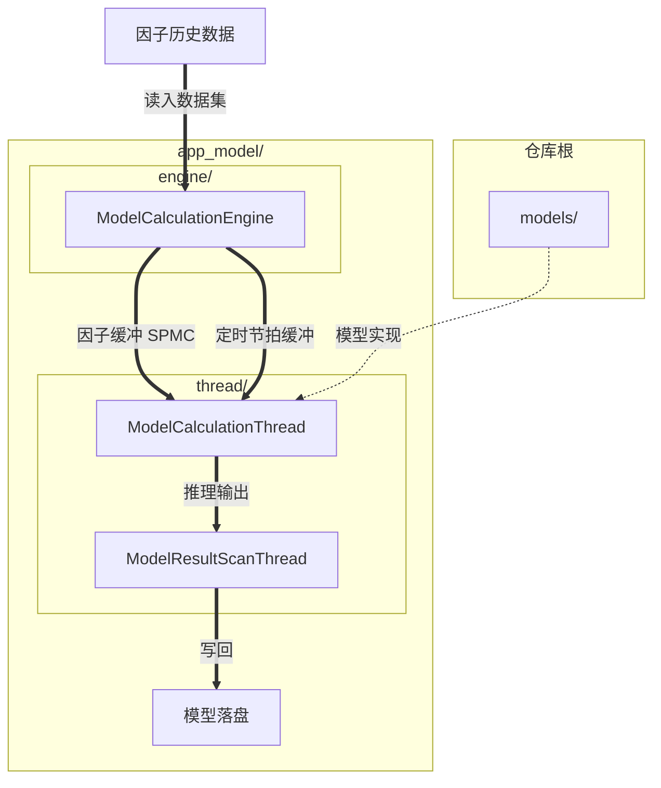

# 高频股票截面因子与模型框架


### 关联项目汇总

以下为按**三种策略模式 × 三种接入形态**分组列出的内网 GitLab 工程链接。**关注与本仓库名称及目录布局相对应的一组即可**。

**Open** 开盘集合竞价
- `app_factor`（因子本地）：[hf-open-factor-demo](http://172.16.12.71/chensi/hf-open-factor-demo)
- `app_model`（模型本地）：[hf-open-model-demo](http://172.16.12.71/chensi/hf-open-model-demo)
- `app_live`（平台 Live）：[hf-open-live-demo](http://172.16.12.71/gaowang/hf-open-live-demo)

**Close** 收盘集合竞价
- `app_factor`（因子本地）：[hf-close-factor-demo](http://172.16.12.71/chensi/hf-close-factor-demo)
- `app_model`（模型本地）：[hf-close-model-demo](http://172.16.12.71/gaowang/hf-close-model-demo)
- `app_live`（平台 Live）：[hf-close-live-demo](http://172.16.12.71/gaowang/hf-close-live-demo)

**Continuous（套件名 open5m）** 日内连续竞价
- `app_factor`（因子本地）：[hf-open5m-factor-demo](http://172.16.12.71/chensi/hf-open5m-factor-demo)
- `app_model`（模型本地）：[hf-open5m-model-demo](http://172.16.12.71/gaowang/hf-open5m-model-demo)
- `app_live`（平台 Live）：[hf-open5m-live-demo](http://172.16.12.71/gaowang/hf-open5m-live-demo)

---

### 文档目录

文档分为 **使用者** 与 **开发者** 两部分：**使用者**侧重选工程、改配置、构建运行与核对输出；**开发者**侧重整体框架与数据流、以及如何在仓库内扩展因子与模型。

**使用者指南**

- [本文档怎么用](#本文档怎么用)
- [通用概念](#通用概念)
- [EV](#ev)
- [配置文件](#配置文件)
- [构建信息](#构建信息)
- [三种接入形态（对照说明）](#三种接入形态对照说明)
- [三种策略模式（纵向差异）](#三种策略模式纵向差异)
  - [三种模式在行为上如何区分](#三种模式在行为上如何区分)
  - [策略模式总览](#策略模式总览)
  - [Open（开盘集合竞价）](#open开盘集合竞价)
  - [Close（收盘集合竞价）](#close收盘集合竞价)
  - [Continuous（连续竞价；配置文件套件名常为 open5m）](#continuous连续竞价配置文件套件名常为-open5m)
- [样例配置文件名（对照）](#样例配置文件名对照)
- [构建与运行](#构建与运行)
- [输出、统计与 Notebook](#输出统计与-notebook)
- [常见问题（使用者）](#常见问题使用者)
- [进一步阅读（使用者）](#进一步阅读使用者)

**开发者指南**

- [整体框架与数据流](#整体框架与数据流)
- [各接入形态目录架构示意](#各接入形态目录架构示意)
- [如何扩展因子与模型](#如何扩展因子与模型)
- **目录内手册**（写具体因子/模型时优先打开）：[`factors/README.md`](factors/README.md) · [`models/README.md`](models/README.md)
- [进一步阅读（开发者）](#进一步阅读开发者)

---

本仓库提供**高频股票截面策略**的计算框架与示例：**接入形态**取决于根目录下是否包含 `app_live`、`app_factor`、`app_model`（通常只会包含其中一类目录）。[通用概念](#通用概念)与 [三种策略模式（纵向差异）](#三种策略模式纵向差异)中的说明用于对照配置；**与当前目录结构不一致的部分可直接跳过**。

---

**术语**：**接入形态**指 `app_live`、`app_factor`、`app_model` 三类运行入口（多数工程只启用其一）。**策略模式**指编译与配置语境下的 **Open / Close / Continuous**（连续竞价；团队口语常称 **open5m**）。二者组合用来命名不同的工程配置，**不是九个独立「时段」**。详细对照表见 [三种接入形态（对照说明）](#三种接入形态对照说明) 与 [三种策略模式（纵向差异）](#三种策略模式纵向差异)。**框架结构、数据流与扩展方式**见 [开发者指南](#开发者指南)。

---


## 使用者指南

### 本文档怎么用

- **日常开发与运行**：以**本仓库根目录**下的 `config_*.json`、`Makefile`、源码及 **`make help`** 为准。
- **需要对照配置时**：可结合上节链接与 [三种策略模式（纵向差异）](#三种策略模式纵向差异) 一节的对照表，理解不同命名与目录布局下的配置含义。
- **需要理解流水线与扩展因子/模型时**：跳转到 [开发者指南](#开发者指南)。


### 通用概念

以下内容对各接入形态与策略模式普遍适用，用于**对照 JSON 与运行现象**（细节以解析代码与根目录样例 JSON 为准）。**模块划分与示意图**见 [整体框架与数据流](#整体框架与数据流) 与 [各接入形态目录架构示意](#各接入形态目录架构示意)。


### EV

下文所称 **EV** 如无特别说明均指配置里的 **`ev` 字段**。**EV** 大致是指：通过文件等形式配置、在运行时初始化阶段加载的数据与配置信息（具体形态见下列各接入形态及 [docs/ev_management.md](docs/ev_management.md)）。

- **Live**：`ev` 常为 **sid 列表**，运行期由平台侧约定解压/聚合。
- **本地 factor/model**：`ev` 常为 **本地目录路径**，需提前准备可读文件。


### 配置文件

- 支持占位符 **`[DATE]`**，运行时可替换为交易日（YYYYMMDD）。
- **`factors_config`**：`factor_sets`（因子集开关、名称）、`send_times` / 触发时刻、`save_info`、`thread_num` 等。
- **`models_config`**：`models`（名称、`enabled`、`ev`、`extra_threads_request`、`runtime_config`、`elapsed` 等）、`save_info`、`thread_num`。
- **`save_info` 形态**：可用单个 **`file_path`**；也可用 **`dir`**，并按需配合 **`save_times`**、`name` 等写多时点、多文件（Continuous / open5m 样例常见后者）。
- **`models[].runtime_config`**：JSON 对象透传到模型内部，键由各模型自定；样例里可能出现**预热**相关键（如 `warmup_offsets` / `warmup_times`），以当前所用模型与 `config_*.json` 为准。
- **时间点表示**：不同策略模式可能使用**毫秒时间戳（常为 9 位 HHMMSSmmm，推荐写法）**或 **秒级 HHMMSS（6 位）**；Continuous（open5m）场景下 `send_times` 还可能为 **`{ start, end, interval, add, skip }` 对象**。请勿假设全局只有一种写法，以 **`config_parser` + 根目录 `config_*.json`** 为准。


### 构建信息

- 启动时常打印构建时间、Git、编译器与运行环境信息，便于对齐版本和运行环境。

---


### 三种接入形态（对照说明）

下表概括三种接入形态的差异；**若根目录只包含其中一种 `app_*`，只需阅读对应列**。

| 维度 | **`app_live`** | **`app_factor`** | **`app_model`** |
|------|----------------|------------------|-----------------|
| **产物** | `build/app_live/libstrategy.so` | `build/app_factor/main` | `build/app_model/main` |
| **典型用途** | 对接模拟/交易平台，端到端因子与模型一体化实时链路 | 本地批量生成因子 HDF5 | 本地离线跑模型生成预测信号 HDF5 |
| **入口** | `app_live/run_strategy.py`（参数见脚本 `--help`） | `./build/app_factor/main ...`（参数见脚本 `--help`） | `./build/app_model/main ...`（参数见脚本 `--help`） |
| **因子侧 `ev`** | 只可以是 sid 列表 | 只可以是本地目录 | — |
| **模型侧 `ev`** | 只可以是 sid 列表 | — | 只可以是本地目录 |
| **调试落盘** | `local_simulate=true` 时才把因子/模型写到 HDF5（具体以配置与代码为准） | 默认落因子 HDF5 | 默认落模型 HDF5 |

三类入口均提供 **help / version**：`app_factor` 与 `app_model` 的编译产物 `main`、`app_live/run_strategy.py` 均支持 `--help`、`-h`、`help` 与 `--version`、`-v`、`version`（具体语义见 [构建与运行](#构建与运行) 中「帮助与版本」），方便查看运行时所支持的命令行参数与其别名，查看构建时的版本和环境信息。

---


### 三种策略模式（纵向差异）

下文按 **策略模式（Open / Close / Continuous）× 接入形态** 归纳差异，主要体现在**业务时间窗口、时间戳习惯、`send_times` 形态、以及 Live 下是否默认对齐合并**。表内为**文档层面的归纳**，实现以当前工程的编译结果与配置为准。**阅读时对齐本工程实际采用的策略模式与接入形态即可**。


#### 三种模式在行为上如何区分

下表从**运行与配置现象**归纳三种策略模式的典型差异；**JSON 里若已显式写出对应字段，以配置为准**（与「仅文档归纳、实现以本工程为准」的说明一致）。需要对照**构建变量、推断结果与编译期分支**时，以根目录 **`make help`**、**`Makefile`**、**`CMakeLists.txt`** 及本仓库内相关源码为准。

| 取值 | 交易语义（文档归纳） | 与另外两种的核心差异（默认倾向） |
|------|----------------------|----------------------------------|
| **Open** | 盘前**集合竞价**时段上的截面任务 | 与 Close 同属「少量固定时点」：**典型**多模型结果**对齐合并**后再下发；HDF5 **常见**单文件或**不按发送时间戳**拆成多文件；**通常不**依赖「全天密网格 + 全局时钟」类触发形态 |
| **Close** | **收盘**集合竞价前窗口上的截面任务 | 与 Open 同属集合竞价语境，差异主要在**业务日历与时刻区间**（如收盘前几分钟），见下方各小节与配置 |
| **Continuous（open5m）** | **盘中连续竞价** | 与集合竞价两态对比：**常见**按时间戳拆分落盘；多模型 **常见**各自独立、**不**对齐合并（先到先发）；**常见**对象型 `send_times` 与更密的时间网格 |

构建与切换工程时以根目录 **`make help`** 为准；若切换策略语境后构建或运行异常，可尝试清理 **`build/`**（例如执行 **`make clean`**）后重新编译。


#### 策略模式总览

下表为**速览**；**默认行为对比**见上一小节（仍以 JSON 为准）。

| 策略模式 | 典型业务窗口（文档描述，示意） |
|----------|--------------------------------|
| **Open**（盘前集合竞价截面） | 如 09:15–09:25，触发常为毫秒级集合竞价时刻 |
| **Close**（收盘集合竞价前截面） | 如 14:57–15:00 |
| **Continuous（团队习惯名称 open5m）** | 如开盘后连续竞价片段（如每1秒，每15秒，每1分钟，每5分钟） |


#### Open（开盘集合竞价）

- **Live**：`send_times` / `trigger_points` 多为**毫秒时间戳数组**；模型侧文档常强调**多模型对齐合并后再下发**。
- **Factor**：毫秒级 `send_times` + `trigger_points`；`save_info` 多为单文件 `file_path`。
- **Model**：`factors_config.save_info.file_path` 指向因子 HDF5；时间点沿因子文件中的时间戳推进；预热等可用 `runtime_config`（如部分 ONNX demo）。


#### Close（收盘集合竞价）

- **Live**：触发集中在收盘前窗口；其它结构与 Open Live 类似。
- **Factor**：毫秒级时刻（如 14:59:59.xxx）；常涉及 **14:57–15:00** 区间数据。
- **Model**：与 Open 模型形态类似，差异在因子文件路径与策略语义。


#### Continuous（连续竞价；配置文件套件名常为 open5m）

- **Live**：`send_times` 常为 **对象**（`start`/`end`/`interval`/`add`/`skip`）；时间可为 **HHMMSS 秒级**；`save_info` 常见 **`dir` + `save_times`**；**`models_config.save_info.merge`** 与 Open/Close 文档差异较大——默认可为 **`false`**（各模型独立、先到先发），`true` 时为对齐合并。
- **Factor**：同样常见对象型 `send_times`、`save_info.dir` + `save_times`。
- **Model**：因子输入可为**目录**（多时间点多文件）；输出也常按时间戳拆文件。

---


### 样例配置文件名（对照）

下列文件名常用于区分策略模式与接入形态。**以根目录实际提供的配置文件为准**（字段随迭代可能更新）。

| 策略模式 | Live | 本地因子 | 本地模型 |
|----------|------|----------|----------|
| Open | `config_live_open.json` | `config_factor_open.json` | `config_model_open.json` |
| Close | `config_live_close.json` | `config_factor_close.json` | `config_model_close.json` |
| Continuous（open5m） | `config_live_open5m.json` | `config_factor_open5m.json` | `config_model_open5m.json` |

另有若干实验/定制模型配置（如 `config_model_open_syb_int8_opt.json`），按需参考。

---


### 构建与运行

在项目根目录执行 **`make help`** 查看全部目标与变量。

```bash
make build-live      # -> build/app_live/libstrategy.so（存在 app_live 时）
make build-factor    # -> build/app_factor/main（存在 app_factor 时）
make build-model     # -> build/app_model/main（存在 app_model 时）
make build           # 默认目标依 Makefile：通常优先 live，否则 factor / model
```

#### 帮助与版本

- **`build/app_factor/main`、`build/app_model/main`**：支持 `--help`、`-h`、`help`（打印用法说明）；`--version`、`-v`、`version`（打印构建信息及已注册因子或模型列表后退出）。
- **`app_live/run_strategy.py`**：同样支持 `--help`、`-h`、`help`（打印完整参数说明）；`--version`、`-v`、`version` 会加载策略动态库并调用 `GetStrategyVersionInfo` 后退出，只会打印构建信息及已注册因子或模型列表，不启动模拟。可用 `so=` / `so_path=` 指定 `.so`；未指定时默认尝试项目根下 `build/app_live/libstrategy.so`。

**`--help` / `--version` 示例**（假定已在项目根目录完成对应 **`make build-*`**；子命令也可用 `-h`、`-v` 或单词形式 `help`、`version`）：

```bash
# 本地因子 / 模型可执行文件
./build/app_factor/main --help
./build/app_factor/main --version

./build/app_model/main --help
./build/app_model/main --version

# Live 入口脚本（与下方「Live 示例」一致，可用 python3 或本机已安装的 3.8）
python3.8 app_live/run_strategy.py --help
python3.8 app_live/run_strategy.py --version
python3.8 app_live/run_strategy.py so=build/app_live/libstrategy.so --version
```

**Live 示例**（参数以 `run_strategy.py` 为准；根目录无 `app_live` 时可跳过）：

```bash
cd app_live
python3.8 run_strategy.py date=20220222 thread_num=10 local_simulate=true
```

**Live 线程与常用参数**（以下为**文档归纳**；**精确语义以 `run_strategy.py --help` 与源码为准**）：

- **`thread_num`**：总线程数中会先预留**少量**框架内线（文档归纳常为 **4**：如行情分发、收集、因子结果扫描、模型结果扫描等），**余下**再参与因子与模型计算分配。
- **`so=` / `so_path=`、`config_file=`、`date=`**：见脚本 **`--help`**；未指定动态库时通常默认尝试项目根 **`build/app_live/libstrategy.so`**。
- **`local_simulate=true`**：调试落盘（因子与模型 **`save_info`** 生效方式依配置）；实盘/联机默认 **`false`**。

**本地因子 / 模型**：使用对应 `build/app_*/main`，并指定 `config_file=`。

> **说明**：部分早期文档中的 **`build/app_local/main`**、**`build/hf-open-model`** 等路径为旧命名；**当前工程统一使用 `build/app_factor/main` 与 `build/app_model/main`**（以构建产物为准）。

---


### 输出、统计与 Notebook

- **HDF5**：路径由 `save_info` 决定；Continuous 场景（配置文件名常为 `*_open5m.json`）常见按目录、多时间点多文件。
- **耗时统计**：在对应编译开关与配置开启时，可生成因子/模型分阶段 CSV（文件名与列以当前实现为准）。
- **检查数据**：仓库内可能包含 `check_local_factor_*.ipynb`、`check_local_model_*.ipynb`、`check_live_data.ipynb` 等，可按当前工程的策略模式与接入形态选用；**检查 Live 落盘前**，需已用 **`local_simulate=true`** 等方式按 `save_info` 生成过输出文件。

---


### 常见问题（使用者）

以下为常见问题**浓缩**；排查时仍应以**当前日志**与 **`config_*.json`** 为准。

- **找不到 EV / 相关数据文件**：核对 **`factors_config.ev` / `models[].ev`**（Live 为 sid 列表，本地为具体目录地址），以及运行目录与打包路径是否可读。
- **演示模型日志提示缺权重等文件**：部分演示模型会探测固定演示路径，**未必导致进程退出**（以日志级别与实际行为为准）。
- **吞吐或延迟偏高**：在总线程预算内增大 **`thread_num`**，并对瓶颈模型提高 **`extra_threads_request`**。
- **多模型「对齐合并」后无输出或长时间无结果（常见于 Open/Close Live）**：各启用模型需在**同一发送时点**均能产出，且合并路径对**输出行数、列宽与资产顺序**等有约定，不满足时可能无法合并或阻塞发送（以当前实现与配置为准）。
- **Continuous（open5m）与 `merge`**：多模型是否对齐合并由 **`models_config.save_info.merge`** 等字段表达，**与 `local_simulate` 的组合语义**以 **`config_*_open5m*.json`** 与解析代码为准，勿与 Open/Close 文档简单类推。

---


### 进一步阅读（使用者）

- **`ev` 约定**：[docs/ev_management.md](docs/ev_management.md)

---


## 开发者指南

面向需要在仓库内**对接架构、核对数据流、或新增因子与模型**的读者；不要求掌握全部引擎实现细节。


### 整体框架与数据流

- **截面计算**：在特定时刻对全市场（或配置子集）做因子/模型推理，而非长时序回测引擎。
- **`app_live`**：行情进入 → 因子引擎 →（队列）→ 模型引擎 → 按配置回传平台；因子与模型之间常用 **SPMC 队列**传递截面结果。
- **`app_factor`**：本地**行情历史数据**（介质与 reader 以配置为准；常见为 HDF5）→ 因子引擎 → 因子落盘（常见 HDF5）。
- **`app_model`**：读**因子历史数据**（常见 HDF5）→ 模型引擎 → 模型落盘（常见 HDF5）。
- **多模型**：可同时启用多个模型；线程预算由总线程数与各模型的 `extra_threads_request` 等共同约束。
- **模块化**：业务逻辑主要在 `factors/`、`models/` 中扩展；引擎与线程在 `app_*/engine`、`app_*/thread`。

下文「各接入形态目录架构示意」给出三套目录对应的模块关系图；**与当前仓库实际存在的 `app_*` 对齐阅读即可**。


### 各接入形态目录架构示意

以下为**文档级示意**：主数据流使用**粗线箭头**（`== 说明文字 ==>`），实现挂载、跨引擎调用等辅助关系使用**点线箭头**（`-. 说明文字 .->`）。命名对齐 `app_*/engine`、`app_*/thread` 与仓库根目录。行情、因子与模型**落盘介质**以配置为准（常见 HDF5）。**Live**：除 **SendFactors** 外，因子引擎 **OnTimer** 会调用模型引擎 **OnHeartbeatTimer**，与定时节拍缓冲共同驱动模型侧节拍。

**`app_live`（编译产物 `libstrategy.so`，由 `strategy.cc` 等接入模拟/交易平台）**



**`app_factor`（可执行文件 `main`，本地批量跑因子）**



**`app_model`（可执行文件 `main`，读因子写模型）**




### 如何扩展因子与模型

业务逻辑主要在仓库根下的 **`factors/`**（因子集）与 **`models/`**（模型）中扩展；构建后本地可执行文件的 **`--version`** 会列出已注册的因子集名与模型名，便于核对配置里的名称是否一致。

**因子（概要）**

1. **新建目录**：推荐复制 **`factors/_template`** 为新目录后改命名空间与元数据。以 **`_` 开头的目录名**（如 `_comm`、`_template`、`_share`）不参与「一个子目录一个因子集」的自动收录，勿把业务因子放在这类目录下。
2. **元数据**：在子目录的 **`meta_config.h`** 中提供 **`kFactorSetName`**、因子个数与名称列表、**`GetMetadata()`**；若因子为**截面**语义，元数据需按 demo（如 `democs00`）使用带 **`is_cross_sectional`** 的构造方式，否则默认为单资产因子集。
3. **入口类**：实现继承自公共基类的 **`FactorEntry`**，在 **`factor_entry.h` / `factor_entry.cpp`** 中编写行情/逐笔/委托回调与 **`DoOnUpdateFactors`** 等逻辑；构造签名与注册方式以同目录下 **`demo0000`**、**`reserved`** 等为准。
4. **注册**：在因子入口源文件末尾使用 **`REGISTER_FACTOR_*`** 宏之一（无静态初始化与带 **`StaticInit`** 两种；有全局资源预加载时用后者），宏中的命名空间名与 **`kFactorSetName`** 需与配置 **`factors_config.factor_sets`** 中的名称一致。
5. **配置与数据**：**`ev`** 路径、键名等与 **`FactorEntryConfig`** 的约定见 [docs/ev_management.md](docs/ev_management.md)；**`reserved`** 因子集由框架侧用于对齐等辅助输出，名称与职责以仓库内该目录为准，新业务因子勿与其重名。

更细的约定、Checklist 与排错见 **[`factors/README.md`](factors/README.md)**。

**模型（概要）**

1. **新建目录**：在 **`models/`** 下新增与模型名一致的子目录（同样勿使用 **`_` 前缀** 作为模型集目录名），参考 **`demo_simple`** 或 ONNX 相关 demo 的目录布局。
2. **元数据**：在 **`meta_config.h`** 中定义 **`kModelName`**、输出维度与名称、**`GetMetadata()`**。
3. **入口类**：实现继承自公共接口的 **`Model`**，至少实现 **`DoOnCalculate`**；定时预热等可覆写 **`DoOnTimerNotice`**（以基类文档与 demo 为准）。
4. **注册**：使用 **`REGISTER_MODEL_AUTO`**，模型名与 JSON **`models_config.models[].name`** 一致。
5. **输入约定**：离线 **`app_model`** 读因子 HDF5 时的数据集与列约定以当前加载实现与本仓 **`config_model_*.json`** 为准；多时点、多文件目录等见上文「配置文件」与使用者章节。
6. **忙标志 `is_busy_`（写具体模型时必读）**：含义、引擎侧作用、维护约定与常见坑见 **[`models/README.md`](models/README.md#model-is-busy)** §3.1；基类长说明见 **`models/_comm/model_base.h`**。

逐步说明见 **[`models/README.md`](models/README.md)**。

**共通注意**

- 修改或新增子目录后需**重新配置并完整编译**对应 **`make build-*`**，再在 **`--version`** 中确认名称已出现。
- 避免在因子/模型目录内使用易冲突的**全局宏**、过短的 **`#ifndef` 守卫**；优先 **`#pragma once`**、**`enum class`**、**`static const`** 或带前缀的命名。
- 生成脚本、各 `app_*` 引擎目录中的公共逻辑非业务需求勿随意改动。


### 进一步阅读（开发者）

- **`ev` 与配置解析**：[docs/ev_management.md](docs/ev_management.md)
- **因子扩展（目录内）**：[factors/README.md](factors/README.md)
- **模型扩展（目录内）**：[models/README.md](models/README.md)
- **构建与集成**：以根目录 **`make help`**、**`Makefile`**、**`CMakeLists.txt`** 与本仓库源码为准。

---

## 常用命令速查

以下均在**项目根目录**执行（与上文 [构建与运行](#构建与运行) 互补，便于日常复制粘贴）。更完整的构建变量与目标见 **`make help`**。

### 构建

```bash
# 默认 Release；make build 的默认目标依当前目录所含 app_* 而定（通常优先 live）
make build
make build-live
make build-factor
make build-model

# Debug 构建
make build-live DEBUG=1
make build-factor DEBUG=1
make build-model DEBUG=1

# 其它常用选项（三类 build-* 均适用，详见 make help）
make build-model NATIVE=ON              # 本机 CPU 指令集优化（部署异机时建议 OFF）
make build-model TIME_STATS=ON          # 强制开启耗时统计（Live 默认可依 Makefile）
make build-live STRATEGY_SESSION_MODE=CLOSE   # 目录名未自动匹配时，可显式指定 Open/Close/Continuous

# 打包到 release/（按当前目录存在的 app_* 分别产出）
make release

# IDE 代码补全/跳转（生成 compile_commands.json，不影响 build/）
make clangd-db
```

| 接入形态 | 主产物 |
|----------|--------|
| **app_live** | `build/app_live/libstrategy.so` |
| **app_factor** | `build/app_factor/main` |
| **app_model** | `build/app_model/main` |

### 运行

```bash
# Live（推荐在根目录执行，便于默认解析 build/app_live/libstrategy.so 与 config_live*.json）
python3.8 app_live/run_strategy.py date=20220222 thread_num=10 local_simulate=true
python3.8 app_live/run_strategy.py date=20220222 thread_num=10 local_simulate=true \
    config_file=config_live_open.json

# 或通过 Makefile（无额外参数，使用 run_strategy.py 默认值）
make run-live

# 本地因子（需 test/ev_data 等行情数据，配置文件见 config_factor_*.json）
./build/app_factor/main date=20220222 thread_num=10 config=config_factor_open.json
make run-factor    # 等价于 build-factor 后无参运行 ./build/app_factor/main

# 本地模型（需先有因子 HDF5；路径见 config_model_*.json 中 factors_config.save_info）
# 典型流程：先跑因子落盘，再跑模型读 H5 回放
./build/app_factor/main date=20220222 config=config_factor_open.json
./build/app_model/main date=20220222 thread_num=10 config=config_model_open.json
make run-model     # 等价于 build-model 后无参运行 ./build/app_model/main
```

**帮助与版本**（三类入口均支持 `--help` / `--version`，见上文「帮助与版本」）：

```bash
python3.8 app_live/run_strategy.py --help
python3.8 app_live/run_strategy.py --version
./build/app_factor/main --help
./build/app_model/main --version
```

### gdb 调试

```bash
# Live：对 libstrategy.so 下断点（进入 gdb 后可 break 符号、catch throw 等）
gdb -ex "set breakpoint pending on" --args python3.8 app_live/run_strategy.py \
    date=20220222 thread_num=10 local_simulate=true

# 本地因子 / 模型：直接调试 main
gdb --args ./build/app_factor/main date=20220222 thread_num=10 config=config_factor_open.json
gdb --args ./build/app_model/main date=20220222 thread_num=10 config=config_model_open.json
```

### 超算提交（根目录）

按任务形态选择脚本或可执行文件；**`-s` 中的路径相对于提交时的工作目录**（建议在项目根提交）。

```bash
# Live 模拟（线程数、日期等可在脚本参数中覆盖）
mybatch -c 32 -m 300G -t 1:0:0 -mail all \
    -s "python3.8 app_live/run_strategy.py date=20220222 thread_num=30 local_simulate=true"

# 本地因子 / 模型（需保证数据与 config 路径在计算节点可读）
mybatch -c 16 -m 64G -t 2:0:0 -mail all \
    -s "./build/app_factor/main date=20220222 config=config_factor_open.json"
mybatch -c 16 -m 64G -t 2:0:0 -mail all \
    -s "./build/app_model/main date=20220222 thread_num=20 config=config_model_open.json"
```

### 清理

```bash
make clean          # 删除 build/
make clean-release  # 删除 release/
make clean-all      # 构建目录 + release + 散落 .o/.so 等
```
