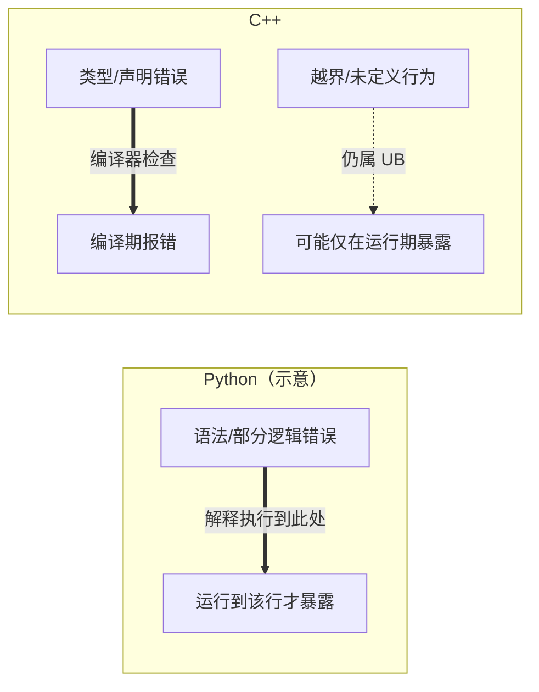

# C++编程指南：给Python研究员

本文档为熟悉 Python、但 C++ 经验较少的研究员编写，侧重在本仓库 **`factors/`** 中实现因子时的语言陷阱与习惯差异。接口类型与基类约定以 **`factors/_comm/factor_entry_base.h`** 及 **`factors/README.md`** 为准。

## 1. C++与Python的主要区别

### 1.1 编译与解释



Python 是解释型语言，不少错误在运行到对应分支时才会暴露。C++ 是编译型语言，**类型与声明**类问题多在编译阶段被拒绝；但**越界、未定义行为**等仍可能在运行期才表现为崩溃或错误结果。

```python
# Python：运行时才会发现错误
def function():
    a = 10
    return a + b  # 运行时错误：b未定义
```

```cpp
// C++：编译时就会报错
void function() {
    int a = 10;
    return a + b;  // 编译错误：b未声明
}
```

这意味着在开发因子时，某些错误（如未定义变量）会在编译阶段被捕获，但逻辑错误和越界访问等问题仍可能在运行时出现。

### 1.2 内存管理

Python自动管理内存，而C++需要开发者更多地关注内存管理。在因子框架中，应尽量使用标准容器（如`vector`、`deque`）而非原始指针：

```cpp
// 不推荐：使用原始指针需要手动管理内存
double* prices = new double[100];
// 使用prices...
delete[] prices;  // 必须记得释放内存

// 推荐：使用标准容器自动管理内存
std::vector<double> prices(100);
// 使用prices...
// 离开作用域时自动释放内存
```

在因子实现中，尽量避免使用`new`和`delete`，减少内存泄漏风险。

### 1.3 类型系统

C++是静态类型语言，变量类型在编译时确定且不可更改：

```cpp
// C++中必须指定类型
int count = 0;
double price = 10.5;
count = price;  // 自动转换为整数，精度丢失
count = "string";  // 错误：不能将字符串赋给整型变量
```

在因子实现中，要特别注意类型转换和精度问题，特别是浮点数和整数的混合运算。

## 2. 因子开发中常见的C++陷阱

### 2.1 整数类型及其运算

#### 无符号整数相减的问题

在处理序列、索引时，无符号整数（如`size_t`、`unsigned int`）的减法可能导致意外结果：

```cpp
// 危险：无符号整数相减会导致意外的结果
std::vector<double> prices = {10.0, 11.0, 12.0};
size_t i = 0;
// 尝试判断索引是否为正，防止越界
if (i - 1 >= 0) {  // 永远为true，因为size_t是无符号类型，i-1会变成一个大正数
    double prev_price = prices[i - 1];  // 越界访问！
}

// 安全方式：使用条件避免减法
if (i > 0) {
    double prev_price = prices[i - 1];  // 安全
}
```

#### 除法截断

整数除法会截断小数部分，这在计算平均值或比率时尤其重要：

```cpp
// 错误：整数除法会截断小数部分
int sum = 15;
int count = 4;
double average = sum / count;  // 结果是3.0，不是3.75

// 正确：至少有一个操作数是浮点数
double average = static_cast<double>(sum) / count;  // 结果是3.75
```

### 2.2 容器操作和边界检查

#### 向量越界访问

C++的`std::vector`不会自动检查边界。在因子计算中，必须确保索引在有效范围内：

```cpp
// 危险：不检查边界
std::vector<double> prices = {10.0, 11.0, 12.0};
double last_5_avg = 0.0;
for (int i = 0; i < 5; i++) {  // 尝试获取最后5个价格的平均值
    last_5_avg += prices[prices.size() - i - 1];  // 当i >= 3时越界！
}
last_5_avg /= 5;

// 安全：检查边界
double safe_avg = 0.0;
int count = 0;
for (int i = 0; i < 5 && i < prices.size(); i++) {
    safe_avg += prices[prices.size() - i - 1];
    count++;
}
if (count > 0) {
    safe_avg /= count;
}
```

#### 空容器访问

访问空容器的元素会导致未定义行为：

```cpp
// 危险：不检查容器是否为空
std::vector<double> prices;
double first_price = prices[0];  // 未定义行为！
double last_price = prices.back();  // 未定义行为！

// 安全：先检查是否为空
double first_price = 0.0;
if (!prices.empty()) {
    first_price = prices[0];
}
```

#### 迭代器失效

在遍历容器的同时修改它可能导致迭代器失效：

```cpp
// 危险：在遍历时修改容器
std::vector<double> prices = {10.0, 11.0, 12.0, 9.0, 13.0};
for (auto it = prices.begin(); it != prices.end(); ++it) {
    if (*it < 10.0) {
        prices.erase(it);  // 迭代器失效，后续行为未定义
    }
}

// 安全：使用erase返回的迭代器
for (auto it = prices.begin(); it != prices.end(); ) {
    if (*it < 10.0) {
        it = prices.erase(it);  // 返回下一个有效迭代器
    } else {
        ++it;
    }
}
```

### 2.3 函数和参数传递

#### 值传递与引用传递

Python 中名字与对象多为绑定关系，函数形参亦不拷贝大对象本身；C++ 默认对非引用形参**按值拷贝**（可能整份复制 `std::vector` 等）：

```cpp
// 值传递：复制整个vector（低效）
void processHistoricalData(std::vector<double> prices) {
    // 对prices的修改不会影响原始数据
    prices.push_back(100.0);
}

// 引用传递：不复制数据（高效）
void processHistoricalData(const std::vector<double>& prices) {
    // 使用const防止修改原始数据
    double avg = calculateAverage(prices);
}

// 非const引用：可以修改原始数据
void updateHistoricalData(std::vector<double>& prices) {
    // 对prices的修改会影响原始数据
    prices.push_back(100.0);
}
```

在因子实现中，对于大型数据结构（如价格历史），应使用引用传递而非值传递，避免不必要的复制。

#### 头文件中的函数定义

在C++中，函数定义放在头文件中需要使用`inline`关键字，否则会导致多重定义错误：

```cpp
// 错误：头文件中没有使用inline的函数定义
// my_factor/helper.h
double calculateAverage(const std::vector<double>& data) {
    double sum = 0.0;
    for (double value : data) {
        sum += value;
    }
    return data.empty() ? 0.0 : sum / data.size();
}

// 正确：使用inline关键字
// my_factor/helper.h
inline double calculateAverage(const std::vector<double>& data) {
    double sum = 0.0;
    for (double value : data) {
        sum += value;
    }
    return data.empty() ? 0.0 : sum / data.size();
}
```

在因子实现中，如果需要在头文件中定义辅助函数，请确保使用`inline`关键字。

### 2.4 类和对象

#### 构造函数初始化列表

C++类成员变量的初始化应使用初始化列表，而不是在构造函数体内赋值：

```cpp
// 不够优雅：在构造函数体内赋值
class PriceAnalyzer {
public:
    PriceAnalyzer(int window_size) {
        window_size_ = window_size;  // 先构造再赋值
        prices_.reserve(window_size);
    }

private:
    int window_size_;
    std::vector<double> prices_;
};

// 更好：使用初始化列表
class PriceAnalyzer {
public:
    PriceAnalyzer(int window_size)
        : window_size_(window_size) {  // 直接初始化
        prices_.reserve(window_size);
    }

private:
    int window_size_;
    std::vector<double> prices_;
};
```

在因子实现中，合理使用初始化列表可以提高代码效率和可读性。

#### 成员变量初始化

C++11后支持在声明处初始化成员变量，这是推荐的做法：

```cpp
class FactorCalculator {
private:
    int lookback_period_ = 20;  // 直接在声明处初始化
    double default_value_ = 0.0;
    std::vector<double> history_;  // 默认构造为空vector
};
```

在因子实现中，这种方式可以确保成员变量始终有合理的初始值，减少未初始化变量引起的问题。

## 3. 因子框架开发中的实际应用

### 3.1 在 FactorEntry 中安全处理行情（示意）

以下演示**构造签名**与 **`Stock_Internal_Book`** 中常见字段（档位价量为整数定点，示例中除以 `10000.0` 示意；实盘请以本字段在你们行情源下的约定为准）。逐笔、委托回调类型见基类纯虚函数声明。

```cpp
class FactorEntry : public comm::FactorEntryBase {
public:
    FactorEntry(const std::string& asset, const comm::FactorMetadata& metadata,
                const comm::FactorEntryConfig& config)
        : comm::FactorEntryBase(asset, metadata, config),
          window_size_(20),
          last_price_(0.0) {
        price_history_.reserve(window_size_);
        volume_history_.reserve(window_size_);
    }

private:
    const size_t window_size_;
    double last_price_;
    std::vector<double> price_history_;
    std::vector<double> volume_history_;

    void DoOnAddQuote(const Stock_Internal_Book& quote) override {
        const double bid = quote.bp_array[0] / 10000.0;
        const double ask = quote.ap_array[0] / 10000.0;
        double mid_price = 0.0;
        if (bid > 0.0 && ask > 0.0) {
            mid_price = (bid + ask) / 2.0;
        } else if (bid > 0.0) {
            mid_price = bid;
        } else if (ask > 0.0) {
            mid_price = ask;
        } else {
            mid_price = last_price_;
        }

        if (price_history_.size() >= window_size_) {
            price_history_.erase(price_history_.begin());
        }
        price_history_.push_back(mid_price);

        if (volume_history_.size() >= window_size_) {
            volume_history_.erase(volume_history_.begin());
        }
        volume_history_.push_back(static_cast<double>(quote.total_vol));

        last_price_ = mid_price;
    }

    void DoOnAddTrans(const Stock_Transaction_Internal_Book_New& quote) override {}
    void DoOnAddOrder(const Stock_Order_Internal_Book_New& quote) override {}

    void DoOnUpdateFactors(int64_t timestamp) override {
        // 安全计算因子，处理边界情况
        if (price_history_.empty()) {
            fvals_[0] = 0.0;  // 设置默认值
            return;
        }

        // 安全计算均值
        double sum = 0.0;
        for (const auto& price : price_history_) {
            sum += price;
        }
        double avg_price = sum / price_history_.size();

        // 避免除零错误
        if (avg_price > 0) {
            fvals_[0] = price_history_.back() / avg_price - 1.0;
        } else {
            fvals_[0] = 0.0;
        }
    }
};
```

### 3.2 高效计算滑动窗口统计量

```cpp
// 计算移动平均线，避免每次重新计算所有数据
class MovingAverageCalculator {
public:
    // 构造函数使用初始化列表
    MovingAverageCalculator(size_t window_size)
        : window_size_(window_size),
          sum_(0.0) {}

    // 添加新数据点并返回新的移动平均值
    double AddValue(double value) {
        // 管理窗口大小
        if (values_.size() >= window_size_) {
            sum_ -= values_.front();  // 移除最旧的数据
            values_.pop_front();
        }

        values_.push_back(value);
        sum_ += value;

        // 安全计算平均值
        return values_.empty() ? 0.0 : sum_ / values_.size();
    }

    // 获取当前平均值
    double GetAverage() const {
        return values_.empty() ? 0.0 : sum_ / values_.size();
    }

    // 获取当前数据点数量
    size_t GetCount() const {
        return values_.size();
    }

    // 清空数据
    void Clear() {
        values_.clear();
        sum_ = 0.0;
    }

private:
    const size_t window_size_;
    std::deque<double> values_;  // 使用deque高效管理两端操作
    double sum_;  // 维护和以避免重复计算
};
```

### 3.3 安全的集合操作示例

```cpp
// 计算两个时间窗口的成交量比率
double CalculateVolumeRatio(const std::vector<double>& volumes) {
    // 安全检查
    if (volumes.size() < 2) {
        return 1.0;  // 默认中性值
    }

    // 找到中点
    size_t mid_point = volumes.size() / 2;

    // 计算前半段成交量
    double early_volume = 0.0;
    for (size_t i = 0; i < mid_point && i < volumes.size(); ++i) {
        early_volume += volumes[i];
    }

    // 计算后半段成交量
    double recent_volume = 0.0;
    for (size_t i = mid_point; i < volumes.size(); ++i) {
        recent_volume += volumes[i];
    }

    // 安全除法
    if (early_volume > 0) {
        return recent_volume / early_volume;
    } else {
        return 1.0;  // 默认中性值
    }
}
```

## 4. 性能优化技巧

### 4.1 避免热点路径中的内存分配

在频繁调用的回调（如 **`DoOnAddQuote`**）中，避免每次创建新的 **`std::vector`** 等会分配堆内存的对象；可改为**成员变量**并在每次回调中 **`clear()`** 后复用容量。

```cpp
class FactorEntry : public comm::FactorEntryBase {
public:
    FactorEntry(const std::string& asset, const comm::FactorMetadata& metadata,
                const comm::FactorEntryConfig& config)
        : comm::FactorEntryBase(asset, metadata, config) {}

private:
    std::vector<double> temp_prices_;

    void DoOnAddQuote(const Stock_Internal_Book& quote) override {
        temp_prices_.clear();
        (void)quote;
        // 向 temp_prices_ 填充数据，复用已分配容量
    }
    void DoOnAddTrans(const Stock_Transaction_Internal_Book_New& q) override { (void)q; }
    void DoOnAddOrder(const Stock_Order_Internal_Book_New& q) override { (void)q; }
    void DoOnUpdateFactors(int64_t ts) override { (void)ts; }
};
```

### 4.2 预分配容器容量

当知道容器大致大小时，预先分配容量可以避免多次重新分配内存：

```cpp
// 低效：没有预分配容量
std::vector<double> prices;
for (int i = 0; i < 1000; ++i) {
    prices.push_back(getPrice(i));  // 可能导致多次重新分配内存
}

// 高效：预分配容量
std::vector<double> prices;
prices.reserve(1000);  // 预分配足够容量
for (int i = 0; i < 1000; ++i) {
    prices.push_back(getPrice(i));  // 不会导致重新分配内存
}
```

### 4.3 使用适当的容器

为不同的操作场景选择合适的容器：

```cpp
// 需要快速随机访问，但较少插入/删除操作：使用vector
std::vector<double> prices;  // 随机访问O(1)

// 需要在两端频繁插入/删除：使用deque
std::deque<double> price_window;  // 两端操作O(1)，随机访问也是O(1)

// 需要频繁查找和维护顺序：使用map
std::map<std::string, double> stock_prices;  // 按键排序，查找O(log n)

// 需要频繁查找但不关心顺序：使用unordered_map
std::unordered_map<std::string, double> stock_prices;  // 哈希表，平均查找O(1)
```

## 5. 调试技巧

### 5.1 使用断言验证假设

断言可以帮助你在开发过程中捕获错误，并在出现问题时提供有用信息：

```cpp
#include <cassert>

void CalculateVolatility(const std::vector<double>& returns) {
    // 验证输入数据
    assert(!returns.empty() && "Returns vector cannot be empty");

    double sum = 0.0;
    double sum_sq = 0.0;

    for (double ret : returns) {
        sum += ret;
        sum_sq += ret * ret;
    }

    double mean = sum / returns.size();
    double variance = sum_sq / returns.size() - mean * mean;

    // 验证计算结果
    assert(variance >= 0 && "Variance must be non-negative");

    double volatility = std::sqrt(variance);
    // 使用volatility...
}
```

### 5.2 分析段错误和崩溃

当程序崩溃时，通常是由于以下原因：

1. **越界访问**：访问数组或容器边界外的元素
2. **空指针/引用**：解引用空指针或访问空容器
3. **释放后使用**：使用已释放的内存
4. **栈溢出**：无限递归或过大的局部变量

建议使用调试器（如GDB或VS Code调试器）定位问题：

```bash
# 使用GDB调试程序
gdb ./your_program

# 在GDB中运行程序直到崩溃
(gdb) run

# 查看崩溃位置和调用栈
(gdb) bt

# 检查变量值
(gdb) print variable_name
```

## 6. 在因子框架中的实践建议总结

1. **使用容器代替原始数组**：减少内存管理错误
2. **总是检查索引和容器边界**：避免越界访问
3. **使用引用传递大型数据结构**：提高性能
4. **在头文件中使用inline关键字定义函数**：避免链接错误
5. **预分配已知大小的容器空间**：提高性能
6. **避免在热点路径中分配内存**：减少性能瓶颈
7. **正确处理整数类型，特别是无符号整数**：避免意外行为
8. **使用断言验证假设**：早期捕获错误
9. **初始化所有变量**：避免未定义行为
10. **注意浮点数精度和整数除法**：确保计算准确性

遵循这些建议可以帮助你编写更安全、更高效的因子实现，减少常见错误和调试时间。