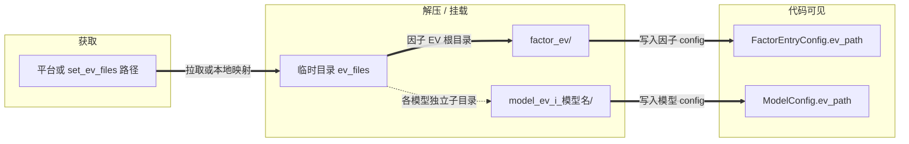
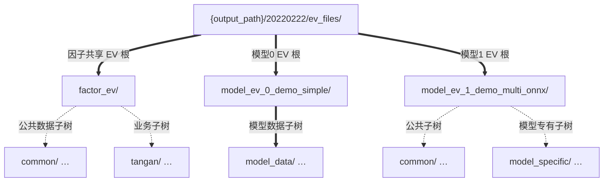

# EV 配置说明

## 文档目录

- [简介](#简介)
- [EV 类型说明](#ev-类型说明)
- [因子与模型的 EV 使用规则](#因子与模型的-ev-使用规则)
- [1 平台版（Live）](#1-平台版live)
- [2 本地版（`app_factor` / `app_model`）](#2-本地版app_factor--app_model)
- [3 对因子和模型代码的要求](#3-对因子和模型代码的要求)
- [4 快速参考](#4-快速参考)

---

## 简介

**EV**（External Variables，外部变量）指因子计算与模型推理依赖的外部数据文件集合。框架支持两类典型配置形态：

- **平台版（Live）**：配置里 **`factors_config.ev`** / **`models[].ev`** 多为 **sid**（数值或列表）；运行期由平台或本地模拟逻辑拉取压缩包并解压到临时目录。
- **本地版**：配置里填写 **本地目录路径**（可用 **`[DATE]`** 占位符）；需事先将解压后的目录放到可读路径。对应可执行文件为 **`build/app_factor/main`**、**`build/app_model/main`**（以本仓实际产物为准）。

两种形态下，业务代码均通过 **`FactorEntryConfig.ev_path`** 或 **`ModelConfig.ev_path`**（运行期由引擎填入）拼接相对路径读文件，**同一套拼接逻辑**可在 Live 与本地复用。

---

## EV 类型说明

按**落盘形态**区分（团队约定；解析以运行时代码为准）：

| 类型 | 含义 |
|------|------|
| **A/B 类** | 常为后缀 **`.csv`** 的文件，**内容为 zip 压缩包**；运行期解压到临时或约定目录。A/B 在运维与 sid 维度可能有不同来源，**解压后使用方式一致**。 |
| **C 类** | **已是解压后的目录**；配置指向文件夹，**不再解压**。 |

若因子或模型声明依赖 **C 类 EV**，则该侧通常**只允许该一个 EV 根**，其它 sid/路径可能被忽略（以解析与日志为准）。

---

## 因子与模型的 EV 使用规则

### 因子

- **共享目录**：同一策略内各因子集共享 **`factors_config.ev`** 解析得到的**同一 `ev_path` 根目录**。
- **运维习惯**：常见只配置**一个** sid 或一个路径；框架侧若配置多项，会合并到同一因子根目录，此时**不同包内不得出现会互相覆盖的同名相对路径**。

### 模型

- **按模型独立**：每个 **`models[]`** 项可有各自的 **`ev`**，可多个 sid 或多个路径合并到**该模型专属**目录（见下节目录约定）。
- **无业务 EV 的模型**：若实现不读取 **`ModelConfig.ev_path`** 下的文件（如示例 **`demo_slow`**），配置中可**省略** **`ev`**；引擎侧仍可能为该模型项分配 **`model_ev_{索引}_{模型名}/`** 占位路径，业务代码不应依赖其内容。
- **多 EV 合并**：同一模型多个包解压到同一根下时，同样要求**无冲突的相对路径**。

---

## 1 平台版（Live）

### 1.1 配置文件示例

```json
{
  "factors_config": {
    "ev": 100000,
    "factor_sets": [
      { "name": "demo0000", "enabled": true },
      { "name": "demo0001", "enabled": true }
    ]
  },
  "models_config": {
    "models": [
      { "name": "demo_simple", "enabled": true, "ev": 200000 },
      { "name": "demo_slow", "enabled": true, "runtime_config": { "sleep_time_ms": 50 } },
      { "name": "demo_apitest_onnx", "enabled": true, "ev": 200203 }
    ]
  }
}
```

（`ev` 亦可为 sid 数组；C 类 sid 仍建议单一项。）

### 1.2 本地模拟运行

在 **`app_live/run_strategy.py`** 的本地模拟路径中，为每个 sid 指定本地文件或目录，例如：

```python
task_hdl.set_ev_files([
    {"id": 100000, "type": 0, "path": "/path/to/ev_output_20220222_100000_day.csv"},
    {"id": 200000, "type": 0, "path": "/path/to/ev_output_20220222_200000_day.csv"},
    {"id": 200203, "type": 2, "path": "/path/to/type_c_ev_folder"}
])
```

其中 **`type`**：`0` 常表示 A/B 类（压缩包文件），**`2`** 表示 C 类（目录）。具体枚举以脚本与引擎为准。

### 1.3 运行期处理流程



文字步骤：

1. **获取**：平台拉包或本地模拟给定路径。  
2. **落盘**：在 **`{output_path}/{trading_date}/ev_files/`** 下生成 **`factor_ev/`**（因子共享）及各 **`model_ev_{索引}_{模型名}/`**。  
3. **A/B 类**：解压 zip；**C 类**：直接使用目录，不再解压。  
4. **初始化**：因子侧 **`ev_path`** 指向 **`factor_ev`**；各模型 **`ev_path`** 指向对应 **`model_ev_*`**。

### 1.4 示例目录结构（示意）

假设因子 sid `100000`，模型 `demo_simple` 用 `200000`，`demo_multi_onnx` 用 `200203`（示意多 sid 时以实际配置为准）：



### 1.5 重名文件约定

- **因子 EV**：多包合并到 **`factor_ev/`**，**不允许**出现会互相覆盖的**相同相对路径**；覆盖时**未必报错**。  
- **模型 EV**：每个模型独立根目录；同一模型多包合并时同样**不得**有冲突相对路径。

---

## 2 本地版（`app_factor` / `app_model`）

### 2.1 配置文件示例

```json
{
  "factors_config": {
    "ev": "./test/ev_data/[DATE]/factor_ev",
    "factor_sets": [
      { "name": "demo0000", "enabled": true },
      { "name": "demo0001", "enabled": true }
    ]
  },
  "models_config": {
    "models": [
      {
        "name": "demo_simple",
        "enabled": true,
        "ev": "./test/ev_data/[DATE]/model_ev_demo_simple"
      },
      {
        "name": "demo_slow",
        "enabled": true,
        "runtime_config": { "sleep_time_ms": 50 }
      }
    ]
  }
}
```

### 2.2 使用步骤

1. 将平台依赖的 EV **按与 Live 解压后一致的相对布局**准备到本地。  
2. 因子所有内容放在 **`…/factor_ev/`**；需要 EV 的模型放在各自目录如 **`…/model_ev_demo_simple/`**；不声明 **`ev`** 的模型无需准备对应数据目录。  
3. 运行 **`app_factor` / `app_model`** 时，引擎将 **`ev`** 解析为绝对或相对路径并写入 **`ev_path`**，业务代码拼接子路径的方式与 **Live 一致**。

### 2.3 目录结构示例（与 1.4 对齐）

与上一节 **`factor_ev/`**、**`model_ev_*`** 的**树形结构约定相同**，仅根路径由你指定的本地目录担任。

---

## 3 对因子和模型代码的要求

### 通用要求

- **只通过配置对象取根路径**：因子用 **`FactorEntryConfig::ev_path`**（及兼容字段 **`ev_paths`**，不推荐新代码依赖）；模型用 **`ModelConfig::ev_path`**。  
- **不要硬编码**仓库外的绝对路径。  
- 路径拼接统一使用 **`/`**。

### 因子代码示例（静态初始化中读文件）

```cpp
namespace factors {
namespace my_factor {

inline void StaticInit(const comm::FactorEntryConfig& config) {
    const std::string symbols_file = config.ev_path + "/common/ff_trading_close_symbols.h5";
    // 打开 symbols_file …
}

}  // namespace my_factor
}  // namespace factors
```

若资源与日期强相关，也可在 **`FactorEntry`** 构造函数中使用传入的 **`config`**。

### 模型代码示例（构造函数中读文件）

```cpp
namespace models {
namespace my_model {

MyModel::MyModel(std::vector<std::string> factor_names,
                  const comm::ModelMetadata& metadata,
                  const comm::ModelConfig& config)
    : comm::ModelInterface(std::move(factor_names), metadata, config) {
    const std::string features = config.ev_path + "/model_data/features.h5";
    // 打开 features …
}

}  // namespace my_model
}  // namespace models
```

---

## 4 快速参考

| 场景 | 配置写法 | 准备方式 | 代码读取 |
|------|----------|----------|----------|
| **Live** | `"ev": sid` 或 sid 数组 | 平台或 **`set_ev_files`** | `config.ev_path + "/相对路径"` |
| **本地因子 / 模型** | `"ev": "./data/[DATE]/…"` | 本地目录与 Live 解压布局一致 | 同上 |

**要点**：因子侧多集共享一个 **`ev_path` 根**；模型侧每模型一个根；C 类通常独占；A/B 类按 zip 解压后当普通目录读。
