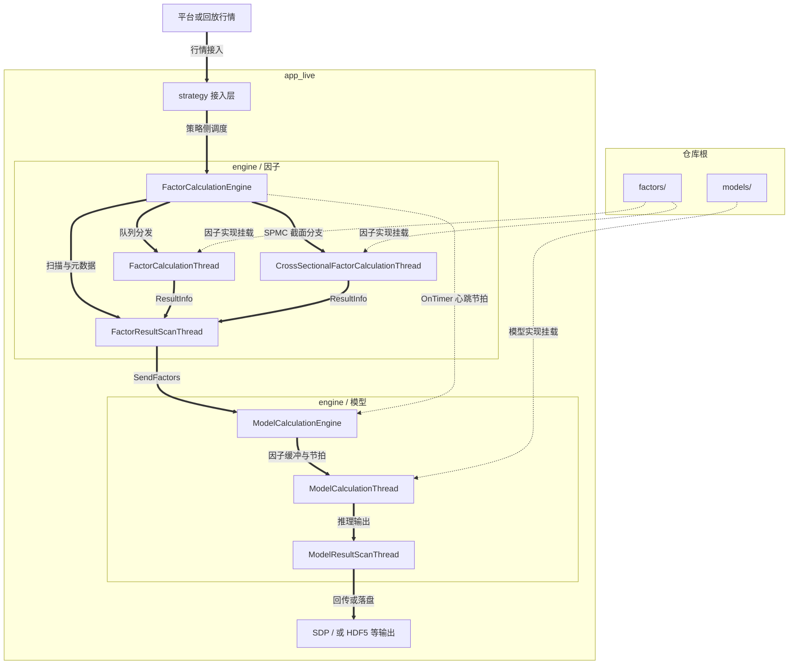
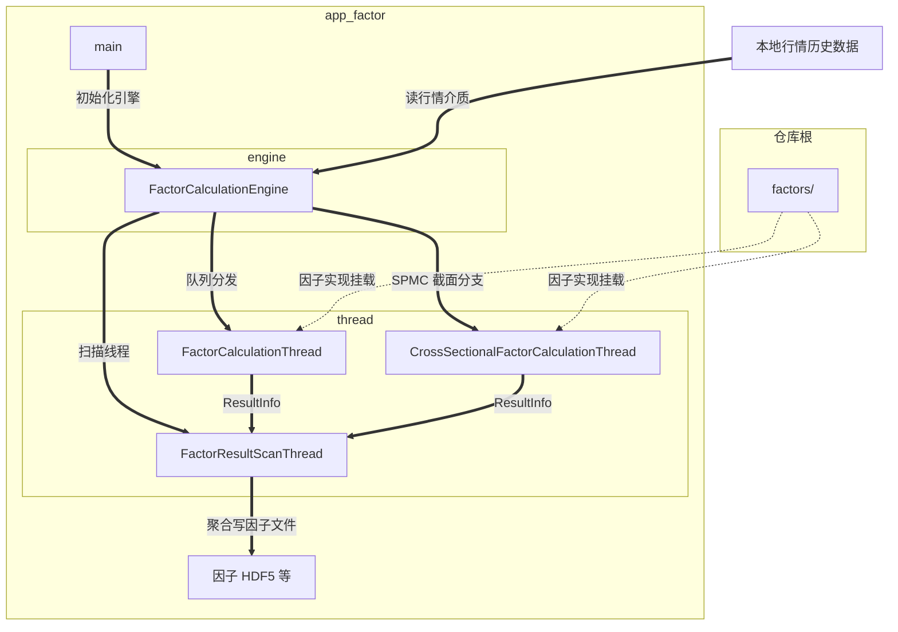
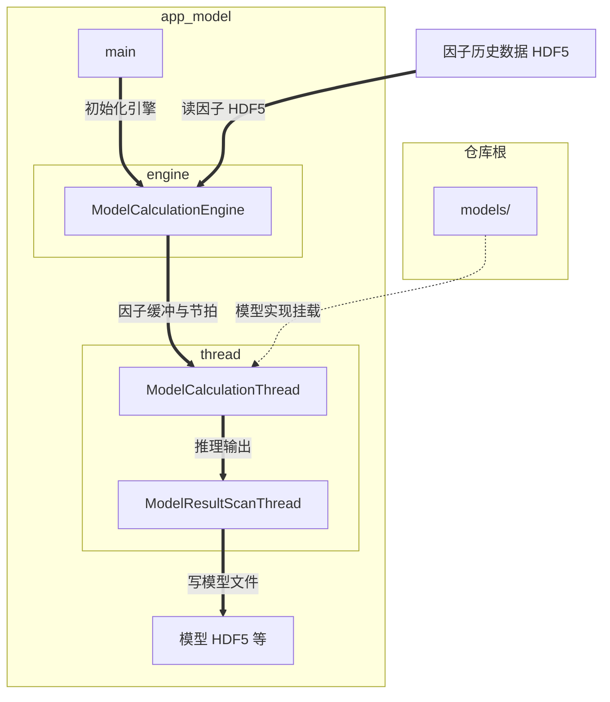

# 系统工作流程

本文档从**数据流与模块分工**角度说明本仓库内高频截面因子框架的典型路径。具体入口、产物路径与三种策略模式（Open / Close / Continuous）的对照以仓库根目录 **`README.md`** 为准；本仓常见为单一 **`app_*`** 目录，与下文不一致处请按实际目录阅读。

## 目录

- [1. 架构概览](#1-架构概览)
  - [1.1 平台 Live（`app_live`）](#11-平台-liveapp_live)
  - [1.2 本地因子（`app_factor`）](#12-本地因子app_factor)
  - [1.3 本地模型（`app_model`）](#13-本地模型app_model)
- [2. 工作流程](#2-工作流程)
- [3. 核心组件](#3-核心组件)
- [4. 小结](#4-小结)

---

## 1. 架构概览

### 1.1 平台 Live（`app_live`）

端到端：**行情 → 因子引擎 → 模型引擎 → 平台或本地落盘**（由配置决定）。策略侧入口以 `app_live` 下 **`strategy.cc`** 等与平台对接的代码为准。

### 1.2 本地因子（`app_factor`）

**历史行情介质**（常见 HDF5，以配置与 reader 为准）→ 因子引擎 → **因子 HDF5**。

### 1.3 本地模型（`app_model`）

**因子 HDF5** → 模型引擎 → **模型 HDF5**。

---

## 2. 工作流程

### 2.1 平台 Live（概要）

**初始化（典型顺序，以实际代码为准）**

1. 与平台或回放环境建立连接，创建 **`SDPHandler`** 等通信组件  
2. 解析 JSON：交易日、线程数、因子集与模型列表、**`ev`** 等  
3. **EV**：Live 下多为 sid；本地模拟时在 `run_strategy.py` 中映射到本地文件（见 **`docs/ev_management.md`**）  
4. 资产过滤等策略前置逻辑（若启用）  
5. 初始化 **`FactorCalculationEngine`** 与 **`ModelCalculationEngine`**  

**运行期数据路径**

平台数据 → 因子计算 → 模型推理 → 按配置回传或 **`local_simulate`** 下写 HDF5  

### 2.2 本地因子（`app_factor`）

1. 解析命令行（日期、线程、**`config_file=`** 等）  
2. 加载配置与行情历史  
3. 初始化因子引擎与线程池  
4. 回放行情 → 因子计算 → 写因子结果文件  

### 2.3 本地模型（`app_model`）

1. 解析命令行与配置  
2. 按路径打开因子 HDF5（数据集与时间戳约定以当前实现与 **`config_model_*.json`** 为准）  
3. 初始化模型引擎  
4. 按时间推进 → 模型推理 → 写模型输出文件  

---

## 3. 核心组件

| 组件 | 作用简述 |
|------|----------|
| **FactorCalculationEngine** | 因子侧调度：行情分发、截面线程、扫描线程创建与元数据 |
| **ModelCalculationEngine** | 模型侧调度：因子批次输入、定时节拍、与模型线程交互 |
| **FactorResultScanThread** | 聚合因子线程结果，触发向模型侧发送等 |
| **ModelResultScanThread** | 聚合模型输出并按配置写回 |
| **因子 / 模型注册表** | 各 **`factors/<名>/`**、**`models/<名>/`** 通过注册宏在进程内登记，**`--version`** 可打印已注册名称 |
| **SDPHandler** | Live 下与平台协议交互（若当前工程包含该模块） |

具体类名与线程名以 **`app_*/engine`**、**`app_*/thread`** 源码为准。

---

## 4. 小结

- **Live**：因子与模型同进程链路，经引擎与队列衔接，输出面向平台或调试落盘。  
- **`app_factor`**：专注批量产出因子文件。  
- **`app_model`**：读因子文件、批量产出模型信号文件。  

扩展因子与模型见根目录 **`README.md`** 及 **`factors/README.md`**、**`models/README.md`**。
