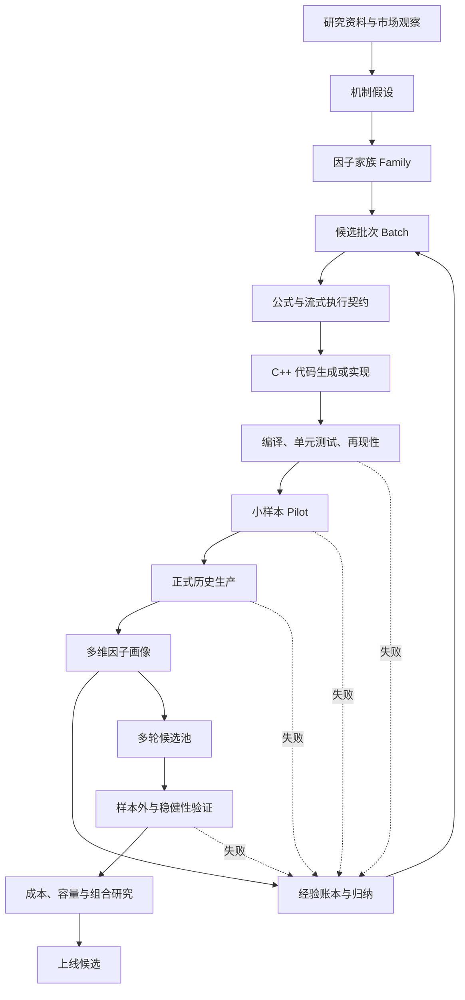

# AutoStream 因子挖掘框架

> 状态：框架基线
>
> 日期：2026-08-26
>
> 适用范围：高频流式因子的提出、实现、生产、评价、经验回流、迭代挖掘和候选池管理。

## 1. 文档目的

AutoStream 的目标不是写一批因子后做一次回测，而是建立一套能够持续工作的因子研究系统：

1. 因子逻辑有明确来源和市场机制；
2. 因子公式能够被转换成可运行、可复现的流式代码；
3. 历史数据能够稳定批量计算；
4. 评价结果形成完整的因子画像，而不是单一分数；
5. 成功、失败和局部有效经验能够进入后续搜索；
6. 系统根据已有证据产生下一批更有针对性的候选；
7. 只有经过多轮挖掘形成的候选池，才进入样本外验证、组合和交易研究。

本框架必须避免两个常见错误：

- 把短期 pilot 当作正式因子研究，并据此淘汰或上线；
- 把单因子评价过早变成策略回测，让成本、仓位和组合规则掩盖因子本身的信息。

## 2. 核心原则

### 2.1 研究闭环优先

AutoStream 的基本循环是：

```text
研究来源
  → 市场机制假设
  → 因子家族与候选批次
  → 公式、参数和状态定义
  → C++ 流式代码
  → 技术验证与历史生产
  → 因子画像
  → 经验归纳
  → 下一批候选
  → 再次验证
```

候选池、样本外验证和组合研究位于多轮挖掘之后，不是每一批种子因子的立即终点。

### 2.2 原始证据不可覆盖

所有评价首先保存原始有符号结果：RankIC、IC、Long-Short、单调性和分组收益。

- RankIC 为负不代表失败；
- 不为了让结果“好看”而自动翻转；
- 不允许按日期、时点、标签或股票池分别选择方向；
- 如果后续需要统一交易方向，必须基于足够长的正式历史一次性冻结，并保留原始方向。

### 2.3 先记录画像，后作决策

一个因子不能只用平均 RankIC 描述。必须同时保留：

- 数据质量；
- 日期分布；
- 事件时点分布；
- 股票池差异；
- 标签差异；
- 分组形态；
- 信号方向和方向稳定性；
- 与同批及历史因子的关系；
- 公式、参数、代码和数据血缘。

因子画像是经验回流的基础，晋级或淘汰只是后续决策。

### 2.4 Pilot 与正式研究分离

Pilot 只回答：

- 代码是否正确；
- 数据是否能生产；
- HDF5/Arrow 格式是否正确；
- 因子、标签和股票池能否正确连接；
- 指标是否能完整生成；
- 性能和资源是否可接受。

Pilot 不回答：

- 因子是否长期有效；
- 哪个参数最终最好；
- 因子是否应该淘汰；
- 因子能否上线交易。

因此当前 17 日结果属于工程和评价 pilot，即使它包含真实标签，也不能承担训练、验证和留出职责。

### 2.5 精确去重与统计冗余分离

候选生成阶段应做公式身份的精确去重，避免完全相同的公式、参数和执行计划被重复编译。

统计相关性高不等于候选应立即删除。相关变体可能帮助理解：

- 哪个窗口更稳定；
- 哪种归一化更稳健；
- 信号是否对参数不敏感；
- 哪个版本计算成本更低。

统计聚类和代表因子选择发生在形成正式画像之后。原候选及其证据仍永久保留。

### 2.6 失败也是研究产物

失败必须区分原因：

- 工程失败：编译、运行、数据、格式或资源问题；
- 契约失败：未来数据、事件映射、标签连接或版本血缘问题；
- 假设失败：市场机制没有形成预期信息；
- 参数失败：机制可能成立，但当前窗口、lag、深度或归一化不合适；
- 稳定性失败：局部有效但跨时间、时点、标签或股票池不稳定；
- 冗余失败：存在信息但没有新增信息；
- 组合失败：单因子有信息，但加入候选池后边际贡献不足。

不同失败类型产生不同的下一步，不能统一标记为“因子无效”。

## 3. 总体流程



该流程包含两个循环：

1. **挖掘循环**：候选批次 → 生产 → 画像 → 经验 → 下一批候选；
2. **验证循环**：候选池 → 样本外 → 组合 → 上线或回到经验账本。

AutoStream 当前首先要完成挖掘循环，而不是直接跳到第二个循环。

## 4. 核心研究对象

### 4.1 Campaign

Campaign 是一次有预算、有边界的研究任务，至少定义：

- `campaign_id`；
- 研究目标；
- 因子家族列表；
- 候选预算；
- 数据流；
- 事件时点；
- 标签；
- 股票池；
- 正式历史范围；
- 评价器版本；
- 停止条件。

当前 `sfm_stream_001` 的第一轮预算是 48 个种子候选：

| 家族 | 机制方向 | 第一轮预算 | 当前状态 |
|---|---|---:|---|
| `book_imbalance` | 盘口买卖力量、微价格与价差条件 | 12 | 已完成 pilot |
| `flow_pressure` | 成交与委托流压力 | 12 | 待设计和实现 |
| `liquidity_resilience` | 冲击后的深度恢复与韧性 | 12 | 待设计和实现 |
| `impact_efficiency` | 流量、价格冲击与反转效率 | 12 | 待设计和实现 |

48 是本 campaign 第一轮种子预算，不是 AutoStream 的因子总上限。

### 4.2 Factor Family

Family 表示共享一个经济或微观结构机制的研究空间。每个 Family 必须包含：

- 机制描述；
- 预期捕获的信息；
- 必需数据流和字段；
- 可用基础算子；
- 可变化参数；
- 状态和窗口约束；
- 已知风险；
- 与历史 Family 的关系。

Family 不能仅仅是一个目录名，也不能只用最终公式定义。

### 4.3 Candidate

Candidate 是最小可追踪研究单元。它的身份由以下内容共同决定：

```text
family
+ canonical formula
+ operator binding
+ parameters
+ source fields
+ state/update semantics
+ snapshot semantics
+ availability/warmup policy
```

候选必须有稳定的 `candidate_id` 和 canonical hash。显示名称相同但上述任一项不同，都不能视为同一候选。

### 4.4 Batch

Batch 是一次可比较的候选实验。一个 Batch 应尽量只改变一个清晰维度，例如：

- 同一机制下改变窗口；
- 同一窗口下改变盘口深度；
- 同一原始信号下改变归一化；
- 对一个稳定信号加入不同状态条件。

Batch 的价值在于让评价结果可以解释。一次混合过多机制和参数，经验无法可靠回流。

### 4.5 Factor Portrait

Factor Portrait 是候选在某个正式数据快照上的完整画像，包括原始指标、分布、稳定性和血缘。它是挖掘系统的核心中间产物。

### 4.6 Experience Record

Experience Record 是从一个或多个画像中提炼出的可复用经验。它不能只写“成功/失败”，必须回答：

- 在什么条件下观察到了什么；
- 证据来自哪些日期、事件、标签和股票池；
- 结论的置信范围是什么；
- 下一批应该增加、减少或保持什么；
- 哪些内容只是猜测，尚未验证。

## 5. 阶段划分与证据等级

### L0：研究想法

输入：文章、论文、市场经验、已有代码、历史实验或数据观察。

产物：机制假设，不是因子代码。

最低要求：

- 描述信息来源；
- 解释为什么可能预测未来收益或市场状态；
- 指明所需数据；
- 指明潜在未来数据风险；
- 给出能够证伪的条件。

### L1：候选契约

将机制转成正式候选描述：

- 公式 AST 或 canonical formula；
- 输入字段；
- 窗口和状态；
- update 时机；
- snapshot 时机；
- warmup；
- 无效值策略；
- 参数；
- 复杂度；
- 预期符号仅作为假设记录。

L1 通过不表示因子有效，只表示因子含义清晰且可以实现。

### L2：代码与技术验证

包括：

- 编译；
- 单元测试；
- 边界值；
- finite/NaN/Inf；
- 无未来数据；
- 事件时序；
- 因子名称和列数；
- 基准版本再现性；
- 性能和内存。

对于恢复或重写的历史因子，必须先完成再现性比较：

- 名称；
- 事件点；
- 股票代码和顺序；
- 形状；
- 数值容差。

### L3：Pilot

Pilot 用少量真实交易日贯通：

```text
NPQ 行情 → C++ FactorEntry → HDF5 → Arrow → 标签连接 → 评价结果
```

Pilot 产物：

- 每日生产 receipt；
- HDF5/Arrow schema；
- 行数和代码覆盖；
- 事件映射；
- 标签 join 数；
- 六组合评价是否完整；
- 性能、内存和任务状态；
- 已发现的工程和契约问题。

Pilot 的决策只有：

- 流水线可进入正式历史；
- 流水线需要修复。

不得在 L3 进行正式晋级或淘汰。

### L4：正式历史挖掘

使用 campaign 冻结的长历史数据运行候选批次。历史范围必须覆盖足够的市场状态，不能由当前 pilot 天数替代。

L4 的目标是形成画像和生成下一轮方向，而不是立即上线。

正式历史至少要明确：

- 起止日期和交易日清单；
- 数据版本；
- 事件点；
- 标签版本；
- 股票池版本；
- 停牌、涨跌停和不可交易处理；
- evaluator commit；
- 是否截面去均值；
- 缺失值策略；
- 运行失败和重试策略。

### L5：多轮候选池

经过多轮画像和经验回流后，形成候选池。候选池阶段才开始：

- 统计聚类；
- 代表因子；
- 信息增量；
- 正交性；
- 参数稳健区间；
- 边际贡献。

高相关候选不会从历史中删除，而是归入同一簇并保留谱系。

### L6：样本外与组合研究

候选池冻结后，才定义长期训练、验证和留出区间。这里可以进行：

- 方向冻结；
- 参数冻结；
- 样本外检验；
- 换手；
- 成本；
- 容量；
- 风格与行业暴露；
- 因子组合；
- 模拟交易。

L6 属于候选验证和交易研究，不应反向污染 L4 的原始画像。

## 6. 因子逻辑从哪里来

因子逻辑有五类主要来源。每个候选必须标注来源类型和具体证据。

### 6.1 市场微观结构机制

例如：

- 买卖盘不平衡；
- 微价格偏离；
- 主动成交压力；
- 队列消耗；
- 撤单和补单；
- 流动性恢复；
- 价格冲击与反转。

优先将机制写成可证伪假设，再生成参数变体。

### 6.2 文献、文章与研究报告

文献提供机制、变量或已知异常，但不能直接把最终公式照搬成代码。需要转换为本项目的数据和事件语义，并重新验证。

### 6.3 已有工具和代码资产

旧因子、基础算子和生产代码可以提供候选，但必须补齐：

- 公式身份；
- 参数；
- 数据字段；
- 时间语义；
- 再现性；
- 当前数据上的正式画像。

### 6.4 数据观察

数据观察可以提出假设，例如某类盘口状态下未来收益分布不同。但必须防止先看结果再无限生成解释。观察型假设需要独立历史或后续批次验证。

### 6.5 经验账本

经验账本是 AutoStream 最重要的内部来源。例如：

- 某类信号在宽价差状态更稳定；
- 某窗口对参数不敏感；
- 某归一化导致开盘时点异常；
- 某机制只在小盘股票池有效；
- 某类候选高度冗余。

下一批候选应优先围绕有证据的局部方向扩展，同时保留少量探索预算。

## 7. 因子代码与历史生产

### 7.1 流式实现契约

每个因子必须明确：

- `on_quote`、`on_trade`、`on_order` 更新什么；
- 状态按股票还是截面维护；
- 窗口按事件数还是时间；
- 午间和日间如何重置；
- snapshot 在事件前还是事件后；
- warmup 期间输出什么；
- 无效输入输出 0、NaN 还是 unavailable；
- 是否存在 lag；
- 计算复杂度和内存上界。

这些内容属于因子定义，不能只藏在 C++ 实现里。

### 7.2 代码生成与手工实现

优先路径是：

```text
候选契约 → 正式公式/算子绑定 → 生成 C++ wrapper → 编译 → 测试
```

复杂状态因子允许手工实现，但必须生成等价 manifest，并接受同样的血缘和测试约束。

### 7.3 历史生产

历史计算使用统一的 `app_factor`：

```text
NPQ Quote/Trade/Order
  → DataLoader 合并时序
  → FactorEntry 流式更新
  → 固定事件快照
  → HDF5
  → 严格转换和校验
  → Arrow
```

每个交易日必须记录：

- 二进制 commit；
- 配置 hash；
- 数据日期；
- 因子集合；
- 事件集合；
- 行数；
- 文件 hash；
- 作业号；
- 运行时间；
- 退出状态。

### 7.4 生产完整性门槛

每日 Arrow 进入评价前必须满足：

- 因子名称和顺序一致；
- 事件集合完整；
- 每个事件代码唯一；
- `(symbol, event)` 无重复；
- 所有 required 因子达到覆盖要求；
- 不含 Inf；
- warmup 和 unavailable 与契约一致；
- 生产事件到评价事件映射明确，例如 `92700000 → 92600000`；
- 日期与标签日期一致。

## 8. 因子画像与评价指标

### 8.1 技术质量

- 行数和代码数；
- finite、NaN、Inf、zero；
- 非常数比例；
- 可排序比例；
- warmup 后覆盖率；
- 每日和每事件异常；
- 计算延迟和内存。

### 8.2 预测信息

原始保存：

- Pearson IC；
- Spearman RankIC；
- D1–D10 分组收益；
- D10-D1 或当前 evaluator 定义的 Long-Short；
- 分组单调性。

正式历史画像进一步汇总：

- 均值、中位数和标准差；
- ICIR/RankICIR；
- 正负比例；
- 分位数；
- 滚动统计；
- 极端日贡献；
- 缺失日和失败日。

### 8.3 稳定性维度

每个指标至少按以下维度保留：

- 日期；
- 8 个盘中事件；
- `raw926/ease926`；
- `000985/003800/000906`；
- 市场状态；
- Family 和参数。

不能只保留所有维度平均后的一个数字。

### 8.4 方向处理

画像永远记录原始符号。

负 RankIC 可以代表稳定的反向预测信息。研究阶段重点观察：

- 是否长期同号；
- 标签之间是否同号；
- 股票池之间是否同号；
- 事件之间是否同号；
- 符号变化是否有可解释状态条件。

只有进入 L6 后，才允许为组合构造定义统一方向；该方向一旦冻结，不允许在验证集或留出集重新选择。

### 8.5 冗余与信息增量

冗余分析包括：

- 同日同事件横截面相关性；
- 每日 IC 序列相关性；
- 参数邻域稳定性；
- 条件化后的相关性；
- 加入已有候选池后的增量信息。

相关性高首先形成“同机制簇”经验，不直接删除候选。

### 8.6 单因子画像与策略指标的边界

分组收益和 Long-Short 在 L4 用于描述信号形态。真实交易组合还需要：

- 持仓规则；
- 调仓规则；
- 成交约束；
- 手续费和滑点；
- 冲击；
- 容量；
- 风控。

因此 Sharpe、回撤、成本后收益和容量不是种子因子的第一轮主要筛选依据，它们属于 L6。

## 9. 经验如何记录和回流

### 9.1 账本必须追加，不可改写历史

每次实验追加事件，至少包含：

- campaign/family/batch/candidate；
- 源代码 commit；
- 配置和数据 hash；
- evaluator 版本；
- 证据等级；
- 状态；
- 产物路径；
- 是否允许晋级；
- 父候选和变更说明。

旧结论被新证据推翻时，追加新事件，不覆盖旧事件。

### 9.2 经验分为事实、解释和动作

一个经验记录必须拆成三层：

```text
事实：在什么数据上观察到什么数值或分布。
解释：可能由什么机制导致，置信度多高。
动作：下一批候选具体改变什么，保持什么。
```

事实可审计；解释允许变化；动作必须能落实为新的候选批次。

### 9.3 经验标签

建议使用以下标签：

- `mechanism_supported`；
- `mechanism_unclear`；
- `parameter_sensitive`；
- `parameter_robust`；
- `event_specific`；
- `universe_specific`；
- `label_specific`；
- `regime_specific`；
- `redundant`；
- `data_issue`；
- `implementation_issue`；
- `lookahead_risk`；
- `next_expand`；
- `next_hold`；
- `next_contrast`。

### 9.4 经验驱动的候选生成

下一批候选预算分为：

- 利用预算：扩展已有证据支持的局部区域；
- 对照预算：改变一个变量验证当前解释；
- 探索预算：尝试新的机制或组合；
- 复现预算：验证异常或关键结果。

推荐初始比例不是硬门槛，可由 campaign 冻结，例如：

```text
利用 50% / 对照 25% / 探索 15% / 复现 10%
```

系统不能只追逐一个最高分，否则会快速生成大量近似因子。

## 10. AutoResearch 式运行方式

AutoStream 借鉴 autoresearch 的核心不是“让模型无限写代码”，而是保持一个稳定的实验闭环：

1. 冻结数据和评价契约；
2. 每轮只开放受控的候选空间；
3. 生成一批可解释变更；
4. 编译并运行；
5. 评价器输出标准画像；
6. 记录结果和原因；
7. 根据证据决定下一批；
8. 保留最佳证据和所有失败路径；
9. 继续循环，直到预算或停止条件触发。

与单目标 hill-climbing 不同，因子挖掘是多目标研究。AutoStream 不应把所有指标压成一个总分，而应保留 Pareto 关系，例如：

- 信息强但覆盖弱；
- 信息弱但极稳定；
- 某股票池强；
- 某事件强；
- 高度独立但均值一般；
- 与已有因子重复但计算更便宜。

## 11. 系统组件与职责

| 组件 | 主要职责 | 不负责 |
|---|---|---|
| Research Intake | 文献、文章、已有经验进入假设池 | 直接宣称因子有效 |
| Family Designer | 定义机制、算子和参数空间 | 根据短样本选赢家 |
| Candidate Compiler | canonical 化、去重、生成代码和 manifest | 修改评价结果 |
| Technical Validator | 编译、单测、再现性、未来数据审计 | 投资结论 |
| Production Runner | 历史任务、重试、产物和 receipt | 选择因子 |
| Evaluator | 生成原始指标和画像 | 自动翻转或隐藏负结果 |
| Experience Synthesizer | 从画像提炼事实、解释和下一步 | 覆盖原始证据 |
| Candidate Pool Manager | 聚类、代表性、增量信息 | 改写候选历史 |
| Promotion Reviewer | 样本外、组合、成本和最终门槛 | 参与训练期调参 |

这些职责可以由同一进程或 Agent 执行，但输入输出契约必须分离。

## 12. 目录与产物映射

```text
campaigns/<campaign_id>/
  campaign.json              # campaign 边界和预算
  ideas/                     # family 机制与候选空间
  batches/                   # 每轮候选批次
  candidates/                # canonical candidate manifest
  portraits/                 # 正式历史因子画像
  experience/                # 事实、解释、动作
  manifests/                 # 技术、pilot、生产、评价 receipt
  events.jsonl               # 追加式事件账本

base/hf-open5m-factor-demo/
  factors/                   # FactorEntry 与流式实现
  app_factor/                # 历史回放和 HDF5 生产
  tests/                     # 边界、再现性和语义测试

evaluations/
  run_campaign_technical.py  # 技术验证、数据和列质量
  convert_production_hdf5.py # HDF5 → Arrow 和事件映射
  factor_eval.py             # 基础因子指标
  multi_day_observation.py   # pilot/多日观察汇总
  real_label_scorecard.py    # 真实标签评价和成绩单
  <future_portrait_tools>    # 正式历史多维画像
  <future_validation_tools>  # 后续样本外验证

data/                        # 本地大文件，不进入 Git
```

Git 保存代码、配置、manifest、画像摘要和 hash；原始行情、HDF5、Arrow 和大结果文件保留在数据盘。

## 13. 阶段门槛

### 从 L2 进入 L3

- 编译和单元测试通过；
- 因子契约完整；
- 无未来数据；
- 关键边界行为明确；
- 历史恢复因子再现通过。

### 从 L3 进入 L4

- Pilot 日期全部生产成功；
- required 事件完整；
- 标签和股票池 join 正确；
- 评价矩阵完整；
- 事件映射和行键无误；
- 性能满足正式历史生产要求；
- `promotion_allowed=false`。

### 从 L4 进入 L5

- 长历史画像完整；
- 关键市场状态覆盖；
- 无数据泄漏；
- 多轮候选和经验谱系完整；
- 画像足以判断稳定性、参数敏感性和冗余；
- 研究负责人确认候选池冻结。

### 从 L5 进入 L6

- 候选池、代表因子和方向规则冻结；
- 训练/验证/留出日期冻结；
- 成本与组合规则冻结；
- evaluator 和数据版本冻结。

## 14. 当前项目位置

截至 2026-08-26，`book_imbalance` 已完成 L3：

- 12 个种子候选已实现；
- 当前 C++ 实现与 20251013 历史验收结果再现一致；
- 最大数值误差约 `1.14e-13`；
- 17 个交易日生产完成；
- 每日 8 个事件、12 个因子通过严格 Arrow 校验；
- `raw926/ease926 × 3 个股票池` 六组合评价完成；
- 17 日结果标记为 `observation_only`；
- 负 RankIC 被保留为原始证据；
- 尚未进行正式长历史挖掘、候选池冻结或交易层晋级。

当前位置：

```text
L0 机制假设            部分完成
L1 候选契约            book_imbalance 完成
L2 代码与技术验证      book_imbalance 完成
L3 Pilot               book_imbalance 完成  ← 当前
L4 正式历史挖掘        尚未开始
L5 多轮候选池          尚未开始
L6 样本外与组合研究    尚未开始
```

当前 12 个候选之间的高相关性是 pilot 观察，不是立即删除依据。它说明下一步需要在正式历史中研究参数稳健性，同时补足不同机制家族。

## 15. 接下来的细化任务

### P0：冻结框架契约

1. 冻结 Candidate Manifest schema；
2. 定义 Batch Manifest schema；
3. 定义 Factor Portrait schema；
4. 定义 Experience Record schema；
5. 定义证据等级和允许状态；
6. 将 `observation_only` 与 promotion 状态彻底分离。

产物：四个 schema、示例文件和契约测试。

当前状态：已完成。版本1契约位于 `campaigns/contracts/`，并已统一账本状态机。`observation_only` 已成为合法但禁止晋级的证据状态。

### P1：完成第一轮 48 个种子

1. 保留 `book_imbalance` 12 个作为已验证基线；
2. 设计 `flow_pressure` 机制和 12 个对照清晰的种子；
3. 设计 `liquidity_resilience` 机制和 12 个种子；
4. 设计 `impact_efficiency` 机制和 12 个种子；
5. 为三个新家族补齐流式状态、warmup 和无效值契约；
6. 编译并通过 L2；
7. 使用同一 17 日 pilot 通过 L3。

产物：48 个候选的完整谱系和四个家族的 pilot 画像。

当前状态：`book_imbalance` 的12个 Candidate、1个 Batch 和12张 L3 Pilot Portrait 已迁入统一契约；其余三个家族共36个种子尚未实现。

### P2：定义正式历史挖掘数据集

在运行前冻结：

- 正式历史起止日期；
- 交易日清单；
- 市场状态覆盖；
- 标签和股票池版本；
- 数据可用性；
- Slurm 并发和失败重试；
- evaluator commit；
- 输出目录和 hash 规则。

正式历史范围不能由当前 17 日 pilot 直接替代。

### P3：建立统一因子画像

1. 生成每日 × 事件 × 标签 × 股票池原始指标；
2. 汇总均值、波动、IR、正负比例和滚动统计；
3. 生成参数邻域对比；
4. 生成同批相关性和 IC 序列相关性；
5. 保留异常日贡献；
6. 输出机器可读 portrait 和人类可读报告。

### P4：建立经验回流

1. 从 portrait 生成事实；
2. 对事实提出可证伪解释；
3. 生成下一批动作；
4. 动作转换为 Batch；
5. 记录父候选和改变维度；
6. 用新批次验证解释；
7. 追加结果，不覆盖历史。

### P5：多轮后形成候选池

只有完成若干轮 L4 后，才进行：

- 统计聚类；
- 代表因子；
- 信息增量；
- 候选池冻结；
- 长期训练/验证/留出；
- 成本、容量和组合研究。

## 16. 下一步执行顺序

当前最合理的执行顺序是：

```text
1. 评审并冻结本文档
2. 细化四类 schema 和状态机
3. 将 book_imbalance 的现有文件迁移到新 schema
4. 完成 flow_pressure 12 个种子
5. 完成 liquidity_resilience 12 个种子
6. 完成 impact_efficiency 12 个种子
7. 对 48 个种子执行统一 L2/L3
8. 冻结正式历史数据集
9. 开始第一轮 L4 正式挖掘
10. 画像 → 经验 → 第二轮候选
```

在第 8 步之前，不使用当前 17 日 pilot 划分训练、验证和留出；在第 9 步之前，不根据 pilot 淘汰当前 12 个因子。

## 17. 参考入口

- 微信文章：<https://mp.weixin.qq.com/s/osYmU15HsgXMqQt3TRF9Cg>
- 微信文章：<https://mp.weixin.qq.com/s/piHhTqTBf1R9tae9WTzYxg>
- 微信文章：<https://mp.weixin.qq.com/s/qXe-qJitLfYF2_kDfmvUnA>
- 微信文章：<https://mp.weixin.qq.com/s/yWnebYvb5ipmdzha8mth9g>
- Karpathy autoresearch：<https://github.com/karpathy/autoresearch>

这些资料用于启发研究闭环、自动实验和经验迭代。AutoStream 的具体数据契约、流式语义、证据等级和晋级规则以本文档及仓库内冻结 schema 为准。
